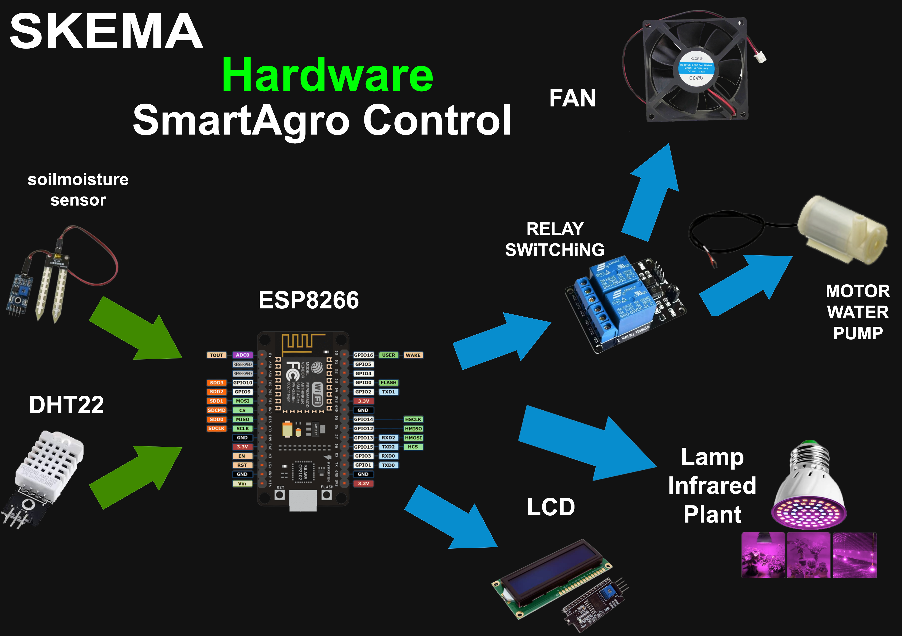
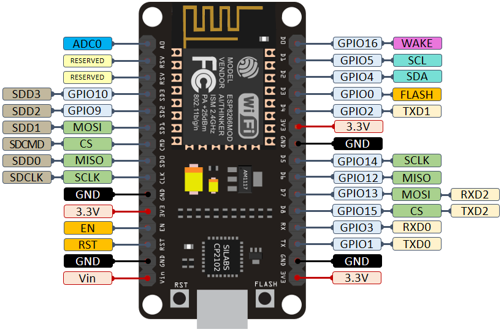

# Smart Agro System with ESP8266

This project implements a smart agriculture system using the ESP8266 microcontroller. It monitors temperature, humidity, and soil moisture levels and controls a fan and a water pump based on threshold values. The system provides a web interface to monitor sensor data and manually control the fan and pump.

## Features

- Monitors temperature, humidity, and soil moisture using DHT22 and soil moisture sensors.
- Automatically controls a fan when the temperature exceeds a set threshold.
- Automatically controls a water pump based on soil moisture levels.
- Displays real-time sensor data on a 16x2 LCD.
- Web interface for monitoring and controlling the fan and pump.

## Components

- ESP8266
- DHT22 Sensor (Temperature & Humidity)
- Soil Moisture Sensor
- 16x2 LCD with I2C
- Relay Modules (2x) for Fan and Pump
- Fan, Water Pump, and LED
- Wi-Fi connectivity for remote control via web server

## Skema Hardware Wiring:

- Below you can see a schematic image to facilitate the wiring of cables from the microcontroller to devices, both input and output sensors:



- For a wiring guide, you can follow the Pinout guide on the ESP8266 in the image below.



## Installation

1. Connect the components as described in the circuit diagram.
2. Update the Wi-Fi credentials in the code:
   ```cpp
   const char* ssid = "your_SSID";
   const char* password = "your_PASSWORD";
   ```
3. Upload the code to the ESP8266 using the Arduino IDE.

## Usage

- Open a web browser and enter the ESP8266’s IP address to access the web interface.
- Monitor the temperature, humidity, and soil moisture.
- Use the buttons on the web interface to manually control the fan and pump.

## Code Explanation

- The system reads temperature and humidity using the DHT22 sensor and soil moisture using an analog input.
- The fan and pump are controlled based on predefined threshold values.
- The 16x2 LCD displays the current temperature, humidity, and soil moisture.
- A web server is hosted on the ESP8266, providing real-time data and control over the fan and pump.

## Conclusion

- The Smart Agro System with ESP8266 provides an efficient and automated solution for monitoring and managing agricultural environments. By integrating sensors and a web-based control interface, this project helps maintain optimal conditions for plant growth, reducing manual effort and enhancing productivity. This system can be easily expanded or customized to meet specific agricultural needs, making it a versatile tool for modern farming.
"# SmartAgro-Control" 
